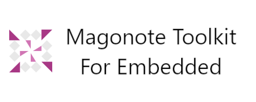

[English](README.md) | [日本語](README.ja.md)

<h2 align="center">
    Software Development Toolkit for Embedded Software Development
</h2>

    
    
    
    
    

## Feature List

### Conversion System
- Radix conversion (to be implemented)
- Frequency<-->Period (to be implemented)
- String<-->ASCII code (to be implemented)

### Generation system
- File clone (to be implemented)
- Folder clone (to be implemented)

### Microcomputer/IC system
- RX630-Register calculation-SCIc.BRR (to be implemented)
- ADF4111-Register calculation (to be implemented)
- R2A20178NP-Register calculation (to be implemented)

### Comparison system
- [Definition comparison](docs/FeatureDetailDefinitionComparison.md)

### Inspection system
- [File inspection](docs/FeatureDetailFileInspection.md)
    - newline character (only shift_jis)
    - newline at end of file (only shift_jis)

## How to install
- Run setup.exe.

## How to uninstall
- Select "MagonoteToolkitForEmbedded" from "Add or Remove Programs (Apps and Features)" and uninstall it.

## Requirements
- [.NET Desktop Runtime 6.0.5](https://dotnet.microsoft.com/en-us/download/dotnet/6.0)

## Development environment
- Microsoft Visual Studio Community 2022
- .NET 6.0.300
- Prism Template Pack(Version.2.4.1)

## Libraries used
- Prism.Unity(Version.8.1.97)
- MaterialDesignThemes(Version.4.5.0)
- MaterialDesignThemes.MahApps(Version.0.2.2)
- MaterialDesignColors(Version.2.0.6)
- MahApps.Metro(Version.2.4.9)
- MahApps.Metro.IconPacks(Version.4.11.0)
- Microsoft-WindowsAPICodePack-Shell(Version.1.1.4)

## License
This project is licensed under the MIT License.  
See [LICENSE](LICENSE) for details.

## Author
[overdrive1708](https://github.com/overdrive1708)

## Changelog
See [CHANGELOG](CHANGELOG.md).
