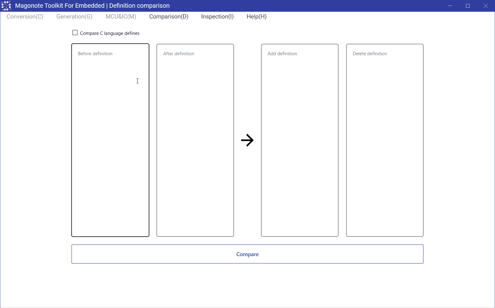
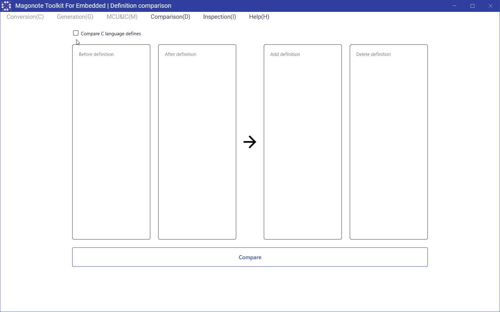

# Definition comparison(定義比較)

## Feature detail(機能詳細)
Definitions before and after the change can be compared.  
変更前後の定義を比較することができます｡  

Check the option "Compare C language defines" to detect changes in C macro definition values.  
｢C言語のdefineを比較する｣オプションをチェックすると､C言語のマクロ定義値の変更を検出できます｡  

