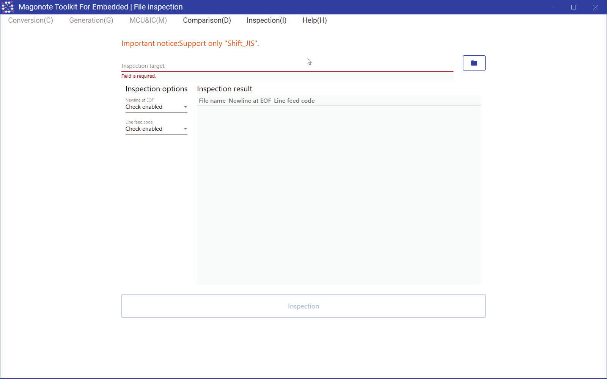

# File inspection(ファイル検査)

## Feature detail(機能詳細)
You can check whether a file in a specified folder ends with a newline or not.  
指定したフォルダ内のファイルについて､末尾が改行かどうか調べることができます｡  

You can check the line feed code of files in the specified folder.  
指定したフォルダ内のファイルについて､改行コードを調べることができます｡  

