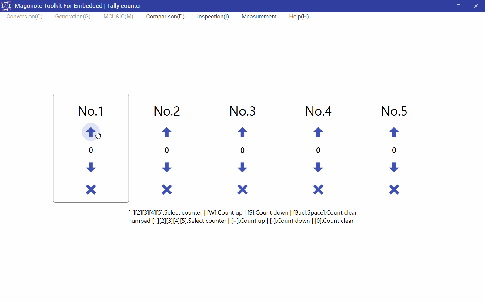

# Tally counter(数取器)

## Feature detail(機能詳細)
Five counters can be operated simultaneously.  
5個同時に操作できるカウンタです｡  

In addition to button operation, keyboard operation is also possible.  
ボタン操作の他にキーボードでの操作も可能です｡  

